# Heinrich Zille X SimCLR
## Learning representations for Heinrich Zille´s photographs

**Table of content**

[1 Abstract](https://github.com/cemkozcuer/HZilleXSimCLR/blob/main/documentation/DOCUMENTATION.md#1-abstract)  
[2 Introduction](https://github.com/cemkozcuer/HZilleXSimCLR/blob/main/documentation/DOCUMENTATION.md#1-abstract)  
[3 Experiment Design & Setup](https://github.com/cemkozcuer/HZilleXSimCLR/blob/main/documentation/DOCUMENTATION.md#3-experiment-design--setup)  
[4 Results](https://github.com/cemkozcuer/HZilleXSimCLR/blob/main/documentation/DOCUMENTATION.md#4-results)  
[5 Conclusion](https://github.com/cemkozcuer/HZilleXSimCLR/blob/main/documentation/DOCUMENTATION.md#5-conclusion)  
[6 Outlook](https://github.com/cemkozcuer/HZilleXSimCLR/blob/main/documentation/DOCUMENTATION.md#6-outlook)  
[Appendix](https://github.com/cemkozcuer/HZilleXSimCLR/blob/main/documentation/DOCUMENTATION.md#appendix)  


### 1 Abstract
In this project we applied the self-supervised learning (or contrastive learning) framework to the images of the artist and photographer Heinrich Zille. The image collection is a very small dataset of scans of the authors photographic work. All images are taken around the turn of the 20th century. We conducted different experiments regarding the self-supervised setup and could show in a qualitative analysis that we can model, even under constraints in comparison to the original *SimCLR* setup, artistic aspects of Heinrich Zille´s photographs. We derived also from our  experiments that grayscale images need a different image augmentation than color images. We further achieved best and most interesting results when we used *ImageNet* initialisations of a *Resnet18* network, especially when we also used the supplementary dataset "Date Estimation in the Wild". But we state also that is possible to fine-tune a network, that is pretrained with *ImageNet*, only with a very small dataset like Heinrich Zille´s images with the *SimCLR* framework.

### 2 Introduction

*SimCLR* ([Chen et al., 2020](https://arxiv.org/pdf/2002.05709.pdf)) is a very popular self-supervised framework among other successful frameworks. Benchmarks on popular image benchmark datasets demonstrated recently that self-supervised learning is a very promising approach in order to learn image embeddings and at least on par with supervised techniques. The outstanding advantage against supervised approaches is the fact that no labels are needed. Through heavy image augmentation, aggressive losses and distance operations between positive and negative pairs of images, embeddings can effectively be learned.

Here we will demonstrate an experiment setup in order to investigate and effectively apply *SimCLR* to Heinrich Zilles images. For the experiments we accompany the Heinrich Zille photo collection with a larger dataset, *Date estimation in the Wild* (from [Müller et al., 2017](https://link.springer.com/chapter/10.1007/978-3-319-56608-5_57)).

Further, in a qualitative analysis the created embeddings will be discussed regarding how well they represent Zille´s images and what artistic concepts they can represent.

Like indicated before there are no labels at all (available and) used throughout the project. The whole training of the network and as well the qualitative analysis relies on unsupervised techniques and domain knowledge in photography.

The experiments and analysis will try to answer following research questions:

1. What is a good experiment setup in order to learn embeddings for a very small artistic photo collection like the one of Heinrich Zille with  the self-supervised (or contrastive learning) framework *SimCLR*?
2. How should *SimCLR* be modified in order to create embeddings for the Heinrich Zille dataset?
3. What can embeddings of Heinrich Zille´s images represent that are learned with a self-supervised (or contrastive learning) setup like *SimCLR*? What artistic concepts can be identified by the embeddings?
4. How does *dew* dataset as a pre-task dataset perform in order to learn embeddings for Heinrich Zille´s images?

> Note: Through the following documentation the Heinrich Zille dataset will be called **_HZille_** and the supplementary dataset "Data Estimation in the Wild" will be called **_dew_**.

#### 2.1 ImageNet vs Heinrich Zille photo collection vs "Data Estimation in the Wild" dataset 
In comparison to *ImageNet* (or other mentioned datasets in the *SimCLR* paper) the photographic collection of Heinrich Zille is not a benchmark dataset for object detection in any domain. Heinrich Zille was a caricaturist, graphic designer and artist and was famous for his depiction of Berlins working class at the end of 19th century. It only became public in the 1980s that he used to be a photographer as well. His photographs can be understood as means of collecting impressions and motifs of the milieu he depicted in his drawings. So he was more driven by an artistic expression of composition, representations of the working class milieu and architectural contexts rather than categories of objects like animals, cars etc. which are subjects of benchmark image datasets like *ImageNet*. Zille´s subjects can be more described as different expressions of city architecture, architectural details like entrances placed in image centers, working woman in fallow land, people at fairs, different kind of portraits, depiction of children and people in groups, studio still lifes, documentation of artists working in their studios, typography embedded in city scapes and such. His motifs are difficult to clearly specify and interpret and are subject of art history and image theory research. In art history and image theory distinctive categories are most often anyway absent when describing images. Nevertheless, one research question of this project is in what regard a deep neural networks and a framework like *SimCLR* is able to represent a complex artistic expression as in the photographic collection of Heinrich Zille.

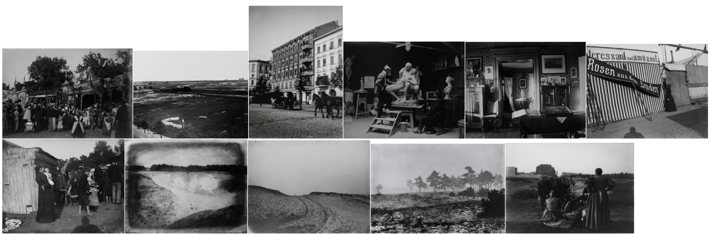
_example images from Heinrich Zille photo collection_

### 3 Experiment Design & Setup

The main focus of the projects experiments is on comparing different ways of training a deep neural network with the *SimCLR* framework.

Originally in the *SimCLR* paper *Resnet* networks got trained on *ImageNet*, which is a huge benchmark dataset. As Heinrich Zille´s photographs consist of only 624 images a bigger dataset was needed in order to be able to train a deep network. However, the experiments also include *Resnets* that are pretrained on *ImageNet*.

But in order to provide such a large dataset beside Heinrich Zille´s images, we made use of parts of the "Date Estimation in the Wild" (*dew*) dataset. The *dew* dataset was originally created to train a network that is able to estimate in which year an image got photographed ([Müller et al., 2017](https://link.springer.com/chapter/10.1007/978-3-319-56608-5_57)). It contains amateur photographs which are to be found on the photo platform flickr. The images date back to 1930. Here a part of the *dew* dataset (images until 1950, 54,114 images) got used to train a neural network in a pre-task manner in order to create embeddings of Heinrich Zille´s images.

As the *dew* dataset contains a large amount of historically "close" images to Heinrich Zille´s photographs the hypothesis is that the *dew* dataset is useful to train a network with *SimCLR* so that it generalizes well enough for Heinrich Zille´s images.

Particularly the experiments are designed as following:

| experiment no. | initialisation | training         | fine-tuning      | embeddings  |
|----------------|----------------|------------------|------------------|-------------|
| 0              | untrained      | none             | none             | HZille_test |
| 1              | _pretrained_   | none             | none             | HZille_test |
| 2              | _pretrained_   | none             | **HZille_train** | HZille_test |
| 3              | _pretrained_   | **dew_train**    | none             | HZille_test |
| 4              | _pretrained_   | **dew_train**    | **HZille_train** | HZille_test |
| 5              | untrained      | **dew_train**    | none             | HZille_test |
| 6              | untrained      | **dew_train**    | **HZille_train** | HZille_test |
| 7              | untrained      | **HZille_train** | none             | HZille_test |
| 8              | _pretrained_   | **HZille_train** | none             | HZille_test |

_"pretrained" here means initialising the network with provided pretrained weights created with_ ImageNet _, whereas "untrained" is the default random initialisation of the used deep learning library_ Pytorch

#### 3.1.1 The network

Due to reasons of computation time and available hardware (1 GPU, either Tesla T4 or Tesla P100, both 16 GB memory) ***Resnet18*** got used instead of *Resnet50* (like in the *SimCLR* paper).

Further to reduce computation time the used *Resnet18* got modified for only processing 1-channel images of Heinrich Zille and the *dew* dataset, as both are grayscale.

Reference in code:
````python
resnet = torchvision.models.resnet18(pretrained=self.pretrained)

# convert model to 1-channel without loosing pretrained weights
# based on fast.ai implementation
# from https://datascience.stackexchange.com/questions/65783/pytorch-how-to-use-pytorch-pretrained-for-single-channel-image

# unpack model architecture / all layers
model_architecture = list(resnet.children())

# store weights of first convolutions
first_conv_weight = model_architecture[0].weight

# replace original layer with new 1-channel convolutional layer
# original: (0): Conv2d(3, 64, kernel_size=(7, 7), stride=(2, 2), padding=(3, 3), bias=False)
new_1_channel_conv = nn.Conv2d(1, 64, kernel_size=7, stride=2, padding=3, bias=False)
model_architecture[0] = new_1_channel_conv

# convert original 3 dimensional weights to 1 dimension
model_architecture[0].weight = nn.Parameter(torch.mean(first_conv_weight, dim=1, keepdim=True))

# pack architecture / layers again into sequential
model_architecture = nn.Sequential(*model_architecture)

# create backbone without original classification head
self.backbone = nn.Sequential(
    *list(model_architecture.children())[:-1]
)
````
> _from the `__init__` method of the network `Module` class. [See more context in the actual code](https://github.com/cemkozcuer/HZilleXSimCLR/blob/main/learning_hzille/learning_hzille.ipynb)._


The original classification head of *Resnet* got removed and substituted with the projection head from the *SimCLR* paper (MLP with 1 hidden layer and relu activation, input: `512`, output: `128`)


#### 3.1.2 Objective function

Like in the *SimCLR* *contrastive cross entropy* loss is used with `temperature` parameter of `0.5`.


#### 3.1.3 Hyperparameter

| parameter                 | value | 
|---------------------------|-------|
| input size                | 128   |
| batch-size training       | 1024  |
| batch-size fine-tuning    | 128   |
| epochs training           | 20    |
| epochs fine-tuning        | 40    |
| learning rate training    | 5e-4  |
| learning rate fine-tuning | 5e-5  |
| optimizer                 | Adam  |
| weight decay              | 1e-6  |

For other hyperparameter of *Adam* the default values of the *Pytorch Lightning* library are used.


#### 3.1.3.1 Batch size (and optimizer)

The authors of the *SimCLR* paper show in ablation tests how the different batch sizes effect the results and conclude that self-supervised learning benefits from large batch sizes. The authors test batch sizes from `256` to `8192` and eventually use a batch size of `4096`. They show also that especially for small epoch numbers (100 epochs) large batch sizes are beneficial. Whereas with more epochs the batch sizes have less effect on learning.

Here, due to the limit of the memory size a batch size of `1024` with an input size of `128` got used for training with the *dew* dataset.
When using the *HZille* dataset a batch size of `128` got used accordingly to the small amount of training samples (437).

Due to time constraints and usage of smaller batches compared to the *SimCLR* paper, *Adam* optimizer got used instead of *LARS*.


#### 3.1.4 Image Augmentations

Image augmentations are essential for self-supervised and contrastive learning. One of the strengths of the *SimCLR* paper is that the authors present a systematic and extensive ablation test about the effect and combination of different image augmentations on their results.

The authors of *SimCLR* eventually used _randomized crops which got resized to the input size_, _gaussian blurring_ and _color jittering_ (which contains of hue, saturation, brightness and contrast jittering).

First tests with the default image augmentations (like the default one in *SimCLR* paper) with the *dew* dataset showed with a look onto nearest neighbours of images in the embeddings space that the images got sorted by their histograms. The authors of *SimCLR* also notice the problem that neural networks might exploit the fact that images are distinguishable by their intensity histograms. *SimCLR* relies on color jittering in order to avoid this problem. Probably because grayscale images get used in this project the color jittering is not sufficient. The default augmentations of *SimCLR* seem not to be strong enough.

In order to avoid this problem here additionally inverting the images and solarization got added to the image augmentations. In the *SimCLR* paper sobel edge detection also achieved quite good results. We assume that intensity inversion and solarization has comparable impact as a sobel representation of the images. 

Further the cropping and resizing, the brightness and contrast jittering and the gaussian blurring got also adjusted and a gamma jittering added to the list of augmentations.

All adjustments of the image augmentations are made with photographic domain knowledge to preserve the visual language of the images, but as well to challenge the learning of the network by difficult to learn positive examples in the *SimCLR* framework.

Implementation of custom image augmentations in code:
```python
class RandomGamma(torch.nn.Module):
    """Apply randomly gamma from torchvision functional transforms."""
    def __init__(self, p=0.5, gamma=(0.5, 1.5), gain=1):
        super().__init__()
        self.p = p
        self.gamma = gamma
        self.gain = gain


    def forward(self, img):    
        if self.p < torch.rand(1):
            return img
        
        gamma = float(torch.empty(1).uniform_(self.gamma[0], self.gamma[1]))
        return torchvision.transforms.functional.adjust_gamma(img, gamma, self.gain)
    

    def __repr__(self):
        return self.__class__.__name__ + '(p={})'.format(self.p)

def get_training_collate_fnc():

    training_transforms = torchvision.transforms.Compose([
        torchvision.transforms.RandomResizedCrop(size=global_config['input_size'], scale=(0.5, 1.0), ratio=(0.5, 2)),
        torchvision.transforms.Grayscale(num_output_channels=1),
        torchvision.transforms.GaussianBlur(kernel_size=21, sigma=(0.1, 1.0)),
        torchvision.transforms.RandomInvert(p=0.2),
        torchvision.transforms.RandomSolarize(threshold=128, p=0.2),
        torchvision.transforms.RandomApply(
            torch.nn.ModuleList([torchvision.transforms.ColorJitter(brightness=(0.2, 1.8), contrast=(0.2, 2.2), saturation=1, hue=0)]), 
            p=0.5
        ),
        RandomGamma(p=0.5, gamma=(0.025, 2), gain=1.05),
        torchvision.transforms.ToTensor(),
        torchvision.transforms.Normalize(
            mean=np.mean(lightly.data.collate.imagenet_normalize['mean']),
            std=np.mean(lightly.data.collate.imagenet_normalize['std']),
        )
    ])

    _collate_fnc = lightly.data.BaseCollateFunction(training_transforms)

    return _collate_fnc
```
> _from class `RandomGamma` and `get_training_collate_fnc` function. [See more context in the actual code](https://github.com/cemkozcuer/HZilleXSimCLR/blob/main/learning_hzille/learning_hzille.ipynb)._

Example batches of both datasets with following image augmentations:
- random crop + resize
- random gaussian blur
- random invert
- random solarise
- random brightness & contrast jitter
- random gamma

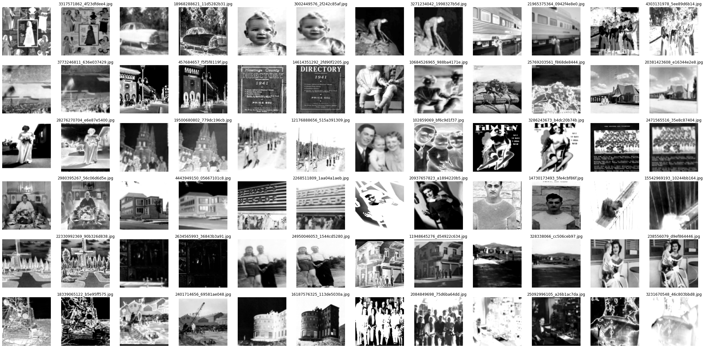
_dew_
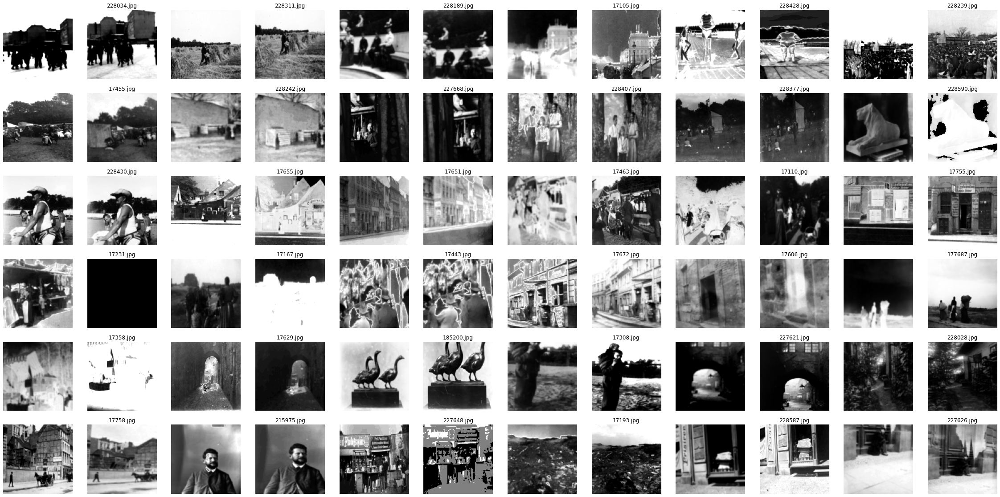
_HZille_


#### 3.1.5 Training and test dataset

Throughout the experiments both the *dew* and *HZille* dataset got split into training and test (in 7:3 proportions). The training set got used for training and fine-tuning. Whereas for creating the embeddings and the qualitative analysis only the test datasets got used. 

### 4 Results

For every experiment, embeddings of Heinrich Zilles images got created with the trained network. All results will be discussed only with the **test dataset**, which contains 188 images. The embeddings of the images contain of 512 dimensions, accordingly to the backbone (without the projection head) of the used *Resnet18* network. These embeddings got used in two different ways for examining the results and images:
1. with **k-nearest neighbours**, in order to display the closest neighbours of specific images in the embeddings space
2. with the dimensionality reduction techniques **PCA** and **t-SNE** to reduce the 512-dimensional embeddings into 2-dimensional and 3-dimensional space in order to cluster the embeddings with **k-means**.

In the following all experiments get compared with each other in a qualitative manner. However, we will only discuss a few key findings in the qualitative analysis as the amount of results can not be worked through qualitatively in a reasonable amount of time. So we understand the here presented qualitative analysis more as a proposal how to approach the evaluation of the results and how such a project could look like and continued. 

The k-nearst neighbour results contain of 9x10x188 = 16,920 images, for having 9 experiments, 10 neighbours for each image and 188 test images in total. So we will here discuss 3 images which we think are important for the artistic expression of Heinrich Zille (9x10x3 = 270 images) and show key insights about the experiments.

Cluster results with k-means contain of 9x188 = 1,692 images for having 9 experiments and clustering all 188 image in each experiment. We will look here at all experiments but only to a few clusters per experiment in order to discuss the results.

However, all results can be found in the [documentation folder](https://github.com/cemkozcuer/HZilleXSimCLR/tree/main/documentation).

> _qualitative analysis_ **is not** _qualitative analysis_: 
> 
> as the project is subject of multiple disciplines (machine learning, art history, image theory) we want to emphasize that the term "qualitative analysis" is used differently in the discipline machine learning than in the disciplines' art history and image theory. The two latter disciplines belong to humanities rather than to natural science. Both art history and image theory have a rich history of describing, analysing and interpreting images and art works, with techniques that are derived from philosophy, phenomenology and ethnography. We will here very freely make use of both worlds without claiming a scientific completeness of all involved disciplines.

In order to discuss how good the neighbourhoods of an image and clusters are we will mainly talk about motifs, formal aspects and composition of  the images.

#### 4.1 k-nearest-neighbours in embedding space

> image rows in the comparisons represent the experiment setup:

| experiment no. | initialisation | training         | fine-tuning      | embeddings  |
|----------------|----------------|------------------|------------------|-------------|
| 0              | untrained      | none             | none             | HZille_test |
| 1              | _pretrained_   | none             | none             | HZille_test |
| 2              | _pretrained_   | none             | **HZille_train** | HZille_test |
| 3              | _pretrained_   | **dew_train**    | none             | HZille_test |
| 4              | _pretrained_   | **dew_train**    | **HZille_train** | HZille_test |
| 5              | untrained      | **dew_train**    | none             | HZille_test |
| 6              | untrained      | **dew_train**    | **HZille_train** | HZille_test |
| 7              | untrained      | **HZille_train** | none             | HZille_test |
| 8              | _pretrained_   | **HZille_train** | none             | HZille_test |

##### 171059.jpg (women pulling/pushing carriage in fallow land)
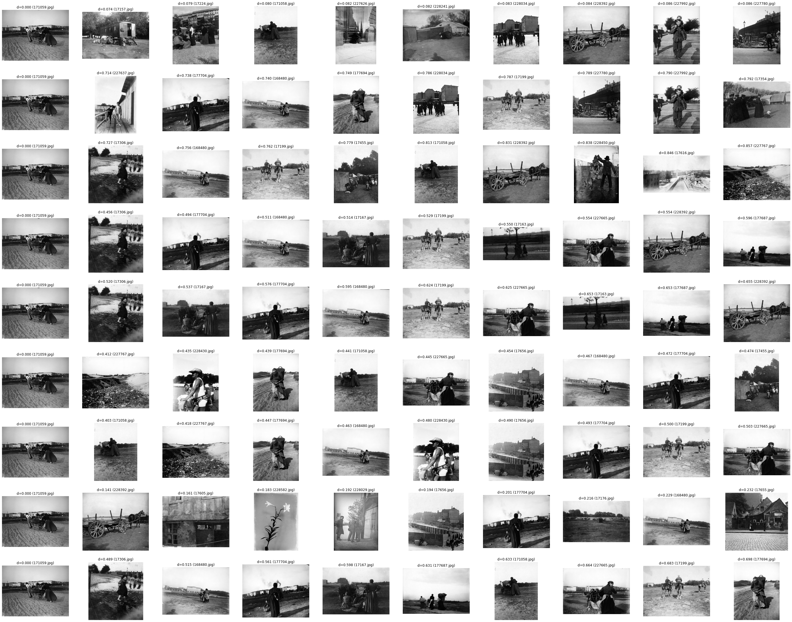

We identify this as one of the key images in Heinrich Zilles photographic collection: women pulling or pushing carriages, at places where there are no ways and streets, basically outside of Berlin, in fallow land.

Experiment 1 (only pretrained weights from *ImageNet*) already manages somewhat to capture that motif. But there are motifs of kids at swimming and some city scapes that do not fit very well in the neighbourhood.
As soon as *HZille* dataset is involved in the learning, the neighbourhoods start to look more consistent. In experiment 2 and 8 only *HZille* dataset is used in learning, but with different learning rates. Experiment 3 and 4, where also *dew* is used appears on par, if not slightly more consistent than experiment 2 and 8. Interestingly in experiment 3 *HZille* is not used, but results are very similar when also using *HZille*. Experiment 5 and 6, where both *dew* and *HZille* is used on an untrained network show that the network learned quite well to focus on persons in comparable distances, but the motifs have some variances compared to the experiments with the pretrained weights.

##### 17173.jpg (man sitting in wood house at a table at night)


This image seems to stick out on the first look on Heinrich Zille´s photographs. But the learned neighbourhoods reveal some interesting connections to other images. The man on the image is photographed through a door, while he is sitting at a table in the house at nighttime.
Experiment 1 (only pretrained weights from *ImageNet*) seems to focus on the size of the heads when modeling the neighbourhood. Compositional aspects, motifs, day time or location is arbitrary. Experiment 3 and 4 show very consistent and surprising results from our point of view. The image with the man photographed through the door has two very strong characteristics of Heinrich Zille´s work it seems: It contains a depiction of a person or persons, and it contains an entrance, placed relatively centrally in the composition of the image. This motif of the *entrance* seems to be very strong through Zille´s work looking at the neighbourhoods of experiment 3 and 4. The network captures this motif in different facets of location and day time. Compositional the images in those neighbourhoods look very close to each other. Experiment 5 and 6 partly seem to fetch the motif of the entrance but mixes in very different motifs and compositions into the neighbourhoods.

##### 227610.jpg (self portrait in studio)
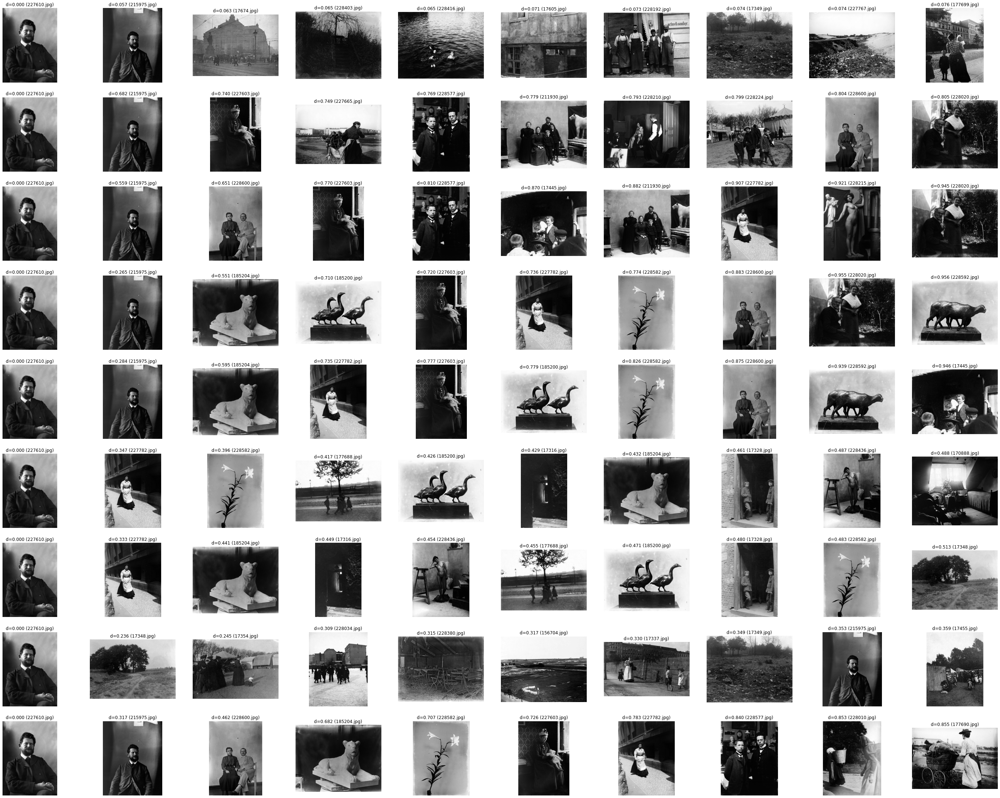

This image show a self-portrait of Heinrich Zille in the studio. Looking at experiment 1 (pretrained *ImageNet* weights) show a similar behaviour of this network as with other images and their neighbourhoods: The depiction of a person is captured quite well throughout the neighbourhood. But looking at experiment where the *dew* and *HZille* dataset is involved shows a much more consistent result: The network captures the photographs which are taken in the studio. Especially experiment 4 is interesting as still lifes that are photographed in the studio appear here in the neighbourhoods. Image 185204.jpg is very interesting in that regard, as it seems a bit odd in that context as depicting a statue of a sitting lyon. But looking at the training dataset, there are multiple images of a bust with a helmet (the knight Wedigo von Plotho) that looks quite like Heinrich Zille himself, but with it´s surface (texture and color) appearing as the statue of the lyon. Besides, such it is likely that the image background of the studio and the light situation in the studio might be captured by the network. It should be mentioned that even the neighbourhoods of experiment 5 and 6 present an interesting consistency between the images, there are images that stick out in these neighbourhoods. Where experiment 2 and 8 had also good results in the two other presented images, here using an untrained network as basis has quite mixed results regarding motifs and compositions of the images.

#### 4.2 Clustering with t-SNE and k-means
The dimensions of the embeddings of all experiments got reduced to three dimension with *t-SNE* and clustered for 9 cluster with *k-means*. The cluster number is not related to the motifs or topics to be found in the photographs.

##### Experiment 1

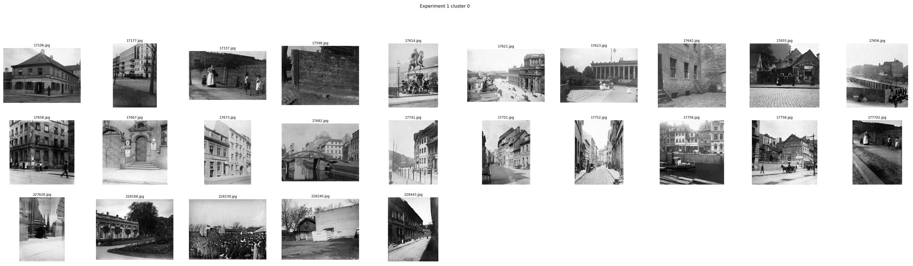

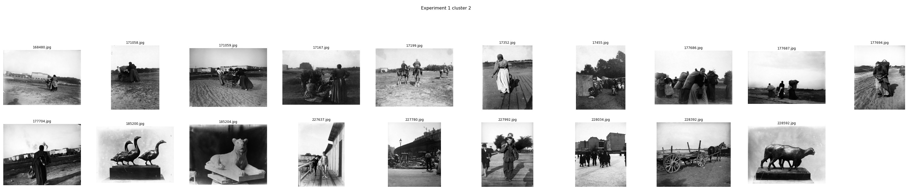

Like already in the nearest neighbour comparisons in embedding space the pretrained network shows a tendency of grouping images with roughly same motifs together: cluster 0 captures architectural and city scape motifs, but does not take composition, distance to objects or smaller details into account. There are also person depictions to be found in the cluster. Cluster 2 contains the motif of *women pulling/pushing carriage in fallow land* but contains a very diverse set of compositions and even mixes studio images into the cluster.

##### Experiment 2

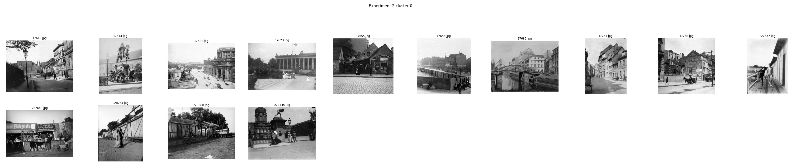

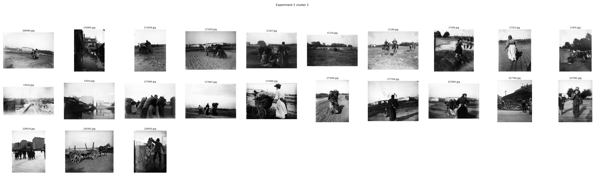

Fine-tuning the pretrained network on *HZille* shows more consistent results compared to experiment 1. Cluster 0 here sticks consistently to more distanced views of architecture where architectural details become quite small on the images. Also cluster 2 is here more consistent than experiment 1. The composition of the horizon seems to play a role here and also the studio image are not present. The motif of the *woman with the carriage in fallow land* is clearly present in different facets, even if some architectural motifs appear here.
 
 ##### Experiment 3

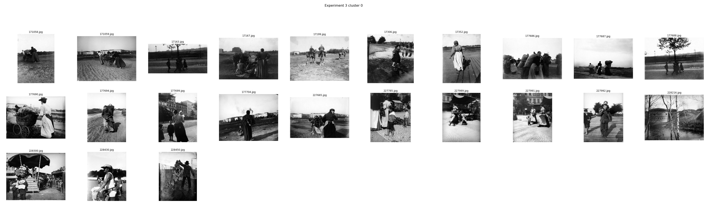

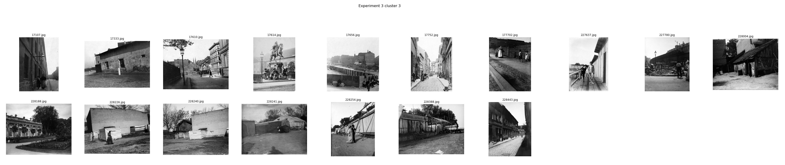

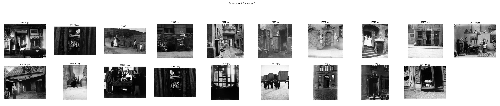

In experiment 3 the pretrained network is overt-rained with *dew*. Looking at clusters 0, 3 and 5 here it seems that experiment 3 is stronger emphasizing composition. Cluster 0 seems to concentrate on persons in a specific distance regardless of the surrounding context. Cluster 3 is heavily characterised by diagonal compositions. And cluster 5 by rectangle like elements in the picture. Whereas in cluster 5 the connection between the images is hold together by an architectural context, cluster 0 and 3 appear more arbitrary by the different poses of the persons and their surroundings.

##### Experiment 4

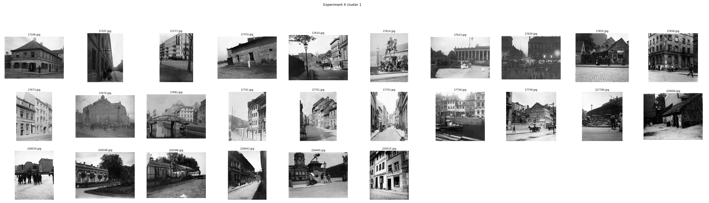

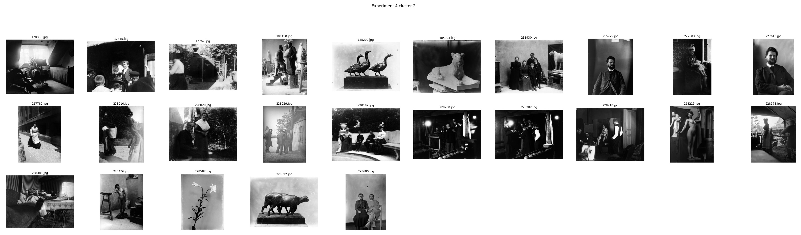

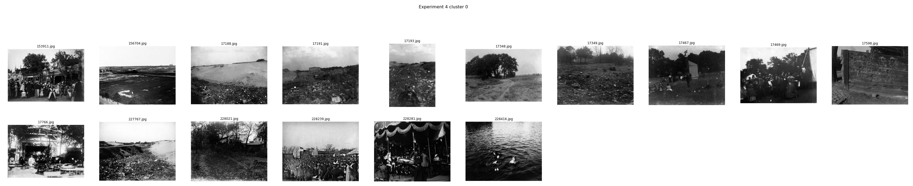

This experiment is both trained with *dew* and *HZille*. Here cluster 1 gives a quite consistent impression of architectural motifs, where an overall comparable composition of diagonals is to be found through all images, but an interesting variance of differences that seem still interconnected formally with each other. From an artistic point of view this combination of consistency and variance is likely to represent the complex interest of an artist or photographer when taking his or her pictures. Also cluster 2 and 0 show this kind of balance. Cluster 2 collects mostly all studio images from the test set, but also other images, but which appear similar to the composition of the studio images. A similar balance is to be found in cluster 0 where granular forms appear both on ground depictions of fallow land as in distance shots from human crowds. These 3 clusters show first in an interesting way the formal interests of Heinrich Zille, but also how Zille connects different motifs formally.

##### Experiment 5, 6 and 7
We don´t discuss these experiment here, as we think that the clusters are of quite mixed results. The clusters can be found in the [documentation folder](https://github.com/cemkozcuer/HZilleXSimCLR/tree/main/documentation).

##### Experiment 8
This experiment is basically the same as experiment 2 but uses a stronger learning rate and fewer epochs for learning. The results of experiment 2 appear very comparable but a little more consistent to us. So we will not further discuss here experiment 8.
 
### 5 Conclusion
First we think that we were able to successfully apply *SimCLR* even if we did constrain it compared to the original paper regarding network capacity, computation time, smaller batch sizes and a different optimizer.

We can further reaffirm that a heavy **image augmentation** is key to applying the contrastive learning framework SimCLR. In the beginning of our experiments we encountered the network exploiting intensity histograms of images, but could fix it with an according modification of the image augmentations. We assume that the default augmentations of the framework for grayscale image is not sufficient and need adjustments. Our approach consisted here of inverting the images and using solarization. We assume also that a sobel edge representation is useful. 
Further we adjusted the augmentations in with our photographic domain knowledge and intuition in order to preserve and make the network learn the visual language and artistic interests of Heinrich Zille.

To come back to the **experiment design**. We achieved best results everytime when the *Resnet18* network was initialized pretrained with *ImageNet*. But the experiments showed also that *ImageNet* alone (experiment 1) is not sufficient in order to represent Heinrich Zilles images. Despite having  a vague correct tendency of motifs, *ImageNet* alone lacked to represent composition, distances of buildings and persons and also contextual surroundings. Fine-tuning the pretrained network with *HZille* (experiment 3) showed successful but also some mixed results. Whereas we think after a first qualitative analysis that the best and most interesting results got achieved when using a pretrained network, that gets overt-rained with *dew* and then fine-tuned with *HZille* (experiment 5). Interestingly using only *dew* for overturning (experiment 4) could also help in order to generalize on *HZille*. But initialising the network randomly and the training with *dew* and fine-tuning with *HZille* (experiment 5 and 6) showed a somewhat comparable version of the variant with the *ImageNet* initialisation, but also was perturbed with mixed results.

When looking at the **qualitative analysis of the results**, the experiments show that some aspects of Heinrich Zilles work as an artist are *describable* by a model. For example, we think that one of the key motifs, *women with carriages in fallow land*, are captured quite well in the model. Looking at the image of the man who got photographed through a door revealed a strong motif of Heinrich Zille, the entrance, which can be found in different contexts but most often with a comparable composition. The clusters of experiments 4 show more of this tendency: the formal interests of Heinrich Zille and interconnections between different motifs through formal aspects seem to be modeled in a way that does justice to the complexity of an artistic work.


### 6 Outlook

Even if the results of the experiments already give interesting insights about the possibility to model parts of Heinrich Zilles work and also revealed insights about the work of Heinrich Zille itself, we think there is a lot of space left for improvement.

First more **computing power** could be acquired in order to lift the constraints of the experiments here. An extensive hyperparameter search as well a systematic study of the image augmentations could as well be beneficial for being able to describe and model Heinrich Zille´s work in a more precise and rich way. Also, the used methods in the qualitative analysis (k-nearest-neighbours, t-SNE, k-means) could be substituted with other machine learning techniques and optimized further for their hyperparameters.

Due to the importance of the image augmentations shown in the *SimCLR* paper, we think that an **extensive study on the effect of image augmentation** on learning the embeddings for Zille´s images would be worth the effort.

It is also imaginable to make use of more **domain knowledge** from image theory and art history in order to enrich the data or deepen the qualitative analysis. For example the 648 images of Heinrich Zille are not too much to be labeled by domain experts. **Labeling** could focus rather on artistic categories than object detection. Labels would also allow making use of **more metrics from statistics and machine learning** in order to evaluate the models and adjust the learning. Further qualitative analysis could involve **practices from image theory**, like *vergleichendes Sehen* or **exhibition practices** like in the work of the artists Bernd und Hilla Becher or Abi Warburg where image tables in exhibition spaces could be used in order to evaluate the results.

Additionally, **introspection** and **explainable AI** techniques could be used in order to examine the learned networks and the resulting neighbourhoods of the images.

In order to get more context and more semantic information, the Heinrich Zille image dataset could be enriched with **multi-modal** data: There are for example image descriptions in the metadata, which could be translated into embeddings as well by a state-of-the-art language model in order to learn multi-modal embeddings for the images. There is also metadata about the images available, regarding their sizes, materials, dates, techniques etc.

Besides all that, it would be sure also interesting to try to gather a more historically closer pre-task **dataset** than *dew*. Or use something which is even more related to artistic practise than *dew*.

Another interesting topic to discuss might be the separation of the training and test dataset. This practice assures generalisation and makes the generalisation capabilities of the trained network able to evaluate. But researches like [Rebecca Fiebrink](https://www.doc.gold.ac.uk/~mas01rf/homepage/) (UI & Machine Learning) or the [head Machine Intelligence Design group at Adobe, Patrick Hebron](https://www.youtube.com/watch?v=kk6rh45r0fo), for example state that **overfitting can be actually wanted** in the contexts of machine learning and design when building tools.

When thinking of **applications** for such a project the results show an interesting outlook and possible use cases for art history or image theory work or curation practice in museums. Such a model could offer a "second pair of eyes" that can show interconnections and diverse aspects of an artistic image collections and could assist by giving complete new impulses to analysis and interpretation or could simply be used as a search engine in order to browse an image collection.


### Appendix

### A
All here discussed results plots can be found in the [documentation folder](https://github.com/cemkozcuer/HZilleXSimCLR/tree/main/documentation), included more results. The [`cluster_plots`](https://github.com/cemkozcuer/HZilleXSimCLR/tree/main/documentation/cluster_plots) folder also contains self-containing plotly plots of the t-SNE clustered data as `.html` files. These can be opened in any browser. E.g. [`experiment_4.html`](https://github.com/cemkozcuer/HZilleXSimCLR/blob/main/documentation/cluster_plots/experiment_4.html).

#### B
All test images from the HZille dataset can be found [here](https://github.com/cemkozcuer/HZilleXSimCLR/blob/main/documentation/all_test_images_hzille.png).

#### C 
The code for the actual learning can be found [here](https://github.com/cemkozcuer/HZilleXSimCLR/blob/main/learning_hzille/learning_hzille.ipynb) and is in one google colab notebook due to the constraints given with google colab.

#### D
A static website generator can be found [here](https://github.com/cemkozcuer/HZilleXSimCLR/tree/main/HZille_browser). We used it in order to compare and browse Heinrich Zilles images. The generated `html` file are standalone and can be opened in any browser in order to browse the images (as long as the folder structure of this repo is given).

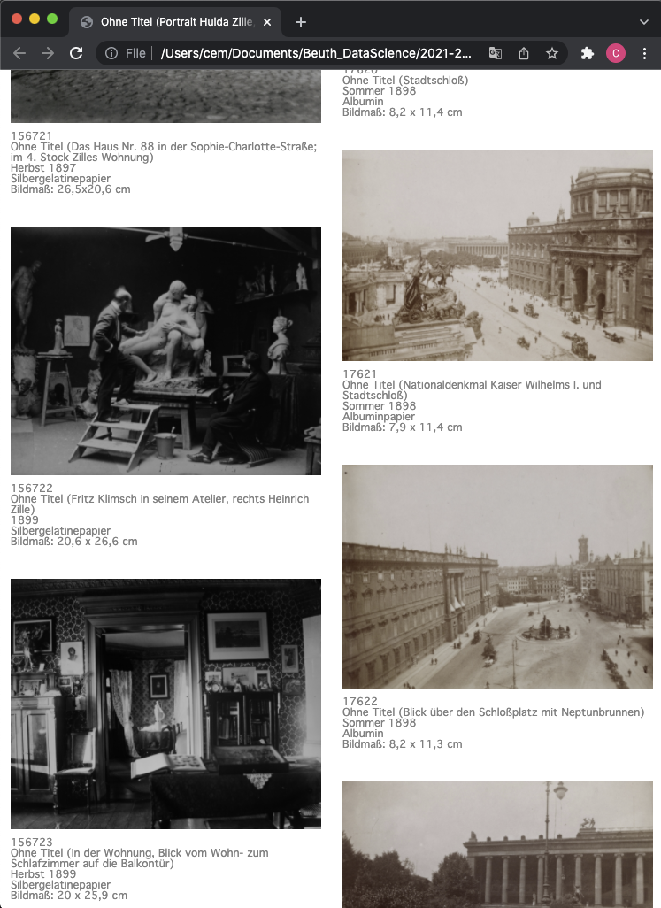

#### E
The script in order to download the "Date Estimation in the Wild" dataset can be found [here](https://github.com/cemkozcuer/HZilleXSimCLR/blob/main/downloading_dew_dataset/download_dew.py).

#### F
A preprocessing script in order to parse the metadata of Heinrich Zille´s image from BIG LIDO format and extract all information regarding the photographs is to be found[here](https://github.com/cemkozcuer/HZilleXSimCLR/blob/main/preprocessing/HZille_meta_data_parsing_XML_to_CSV.ipynb).

#### G
A cropping UI tool in order to remove the color and contrast cards from the scans of the photographs of Heinrich Zille is to be found [here](https://github.com/cemkozcuer/HZilleXSimCLR/blob/main/cropping_tool/HZille_image_cropping_ui.py).

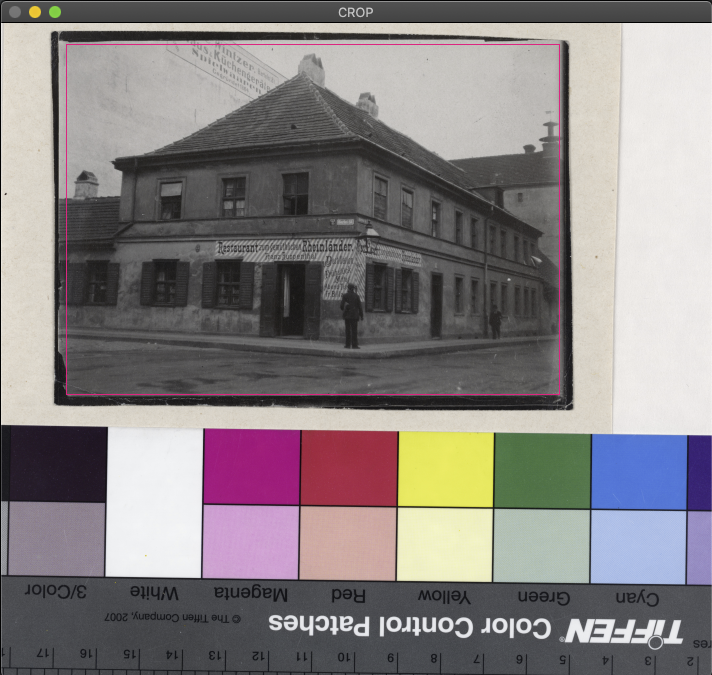

